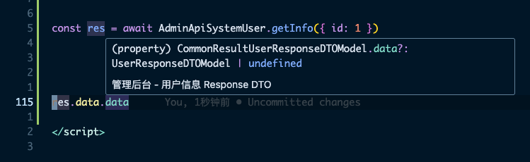

# 代码生成
> **基于 [Swagger](https://swagger.io/)** 的 [OpenApi JSON](https://swagger.io/docs/specification/about), 按照 **[约定的规则](#openapi-规范)** 生成前端所需的 **类型完备** 的 数据层 和 `UI` 层代码

## 安装
```bash
pnpm i @wei/openapi-codegen
```

## 使用
> 代码生成分为两部分:
> - 生成请求代码<sup>(稳定 💪)</sup>: 解析 `Swagger config` 并生成所有接口的请求方法和参数类型, 用法详见 [请求](./request.md)
> - 生成页面代码<sup>(待完善 👨‍💻‍)</sup>: 基于 `UI Schema` 及 `Schema` 组件 渲染页面

> 查看 [图示](#详解)

1. 在 `scripts/openapi-codegen-config.ts` 中增加代码生成所需的配置信息
2. 执行命令生成 `tags` / `models` / `DTO interface` / `JSON Schema` / `UI Schema` 代码
```bash
# 更新 OpenApi JSON 并生成代码
pnpm run codegen
```

3. 生成页面文件

先在 `scripts/openapi-views-codegen.ts` 中更新生成配置 `views`, **生成页面文件的配置及生成逻辑参考 `@wei/openapi-codegen/es/src/CodegenViews`**
```typescript
import { join } from 'node:path'
import { CodegenViews } from '@wei/openapi-codegen/es/src/CodegenViews'
import { codegenConfig } from './openapi-codegen-config'
// import { AdminApiSystemTenant, $tag as AdminApiSystemTenantTag } from '@/api/tags/管理后台租户'

/** entry function */
async function main() {
  // 1. 声明所有 views 的生成配置
  const views = [
    // 租户
    new CodegenViews<AdminApiSystemTenant, typeof AdminApiSystemTenant>(
      codegenConfig,
      AdminApiSystemTenant,
      AdminApiSystemTenantTag,
      { name: '租户', outputDir: join(process.cwd(), './src/views/system/tenant') }
    ),
  ]
  // 2. 调用 generate() 方法生成文件
  await Promise.all(views.map(v => v.generate()))
}

main()
```

执行命令生成页面文件
```bash
pnpm run codegen:views
```

## 术语
::: danger Tips
了解 `OpenApi` 相关术语是深入理解代码生成功能的前提
:::

术语 | 解释 | 备注 | 参考资料
--- |--- |--- |---
[Swagger](https://swagger.io/) | 符合 [OpenApi](https://openapi.xiniushu.com/) 规范的交互式接口文档及其他工具 | 最常用的就是后端提供的 [Swagger UI](https://github.com/swagger-api/swagger-ui) 文档 | [Swagger Doc](https://swagger.io/docs/specification/about/)
[OpenApi](https://openapi.xiniushu.com/) (规范) | 从 2015 年开始将 [Swagger](https://swagger.io/) 规范重命名为 [OpenApi](https://openapi.xiniushu.com/) 规范 | [OpenApi](https://openapi.xiniushu.com/) 使用了 [JSON Schema](https://json-schema.org/understanding-json-schema/index.html) 来定义数据类型, 我们常用的接口文档 **[Swagger UI](https://github.com/swagger-api/swagger-ui) 就是将符合 [OpenApi 规范](https://openapi.xiniushu.com/) 的 `json` 数据作为数据源渲染出来的** | 参考 [OpenApi 规范](https://openapi.xiniushu.com/) / [OpenApi 官方文档](https://swagger.io/docs/specification/about)
[JSON Schema](https://json-schema.org/understanding-json-schema/index.html) | 是一种用于描述和验证 `JSON` 数据结构的规范 | 定义了一个 JSON 文档的结构、数据类型、属性的约束条件以及其他验证规则, 非常适合定义 API 接口 | [JSON Schema](https://json-schema.org/understanding-json-schema/index.html)
`Swagger Config` | `Swagger UI` 中的 `swagger-config` 请求地址, **包含了当前 `Swagger` 中所有的 *服务*(每个服务对应一个 `Swagger` 文档)**, 例如 [🔗](http://10.190.113.233:31017/v3/api-docs/swagger-config)  | `@wei/openapi-codegen` 会从中解析每个 `url` 作为 **数据源** | 参考 `@wei/openapi-codegen` 的 `README.md`
数据源 | `Swagger Config` 中的 `url`; 每个数据源对应一个 `Swagger` 文档 | `@wei/openapi-codegen` 会解析每个数据源并将代码生成到对应的目录中, 从 `2.0.0` 起支持多数据源生成代码 | 参考 `@wei/openapi-codegen` 的 `README.md`

简言之 `Swagger` 是符合 `OpenApi` 规范的工具, `OpenApi` 规范使用 `JSON Schema` 定义数据类型

## 详解


以上是代码生成功能的技术架构图, 自下向上逐步生成前端所需的代码

1. [后端](#后端)
  - [OpenApi JSON](#openapi-规范): **💡 数据结构参考 [OpenApi 基本结构](https://swagger.io/docs/specification/basic-structure/)**
    - `tags`: 对应 `Swagger` 中的每个可展开/折叠的 `tag`
      - [paths](https://swagger.io/docs/specification/paths-and-operations/): 请求路径
    - `schemas`: [JSON Schema](https://json-schema.org/understanding-json-schema/index.html) 格式, 对应后端定义的 `DTO`, 作为请求参数 / 返回值的数据结构定义
  - [Swagger UI](#swagger-ui)
2. 数据层
  - [tags](#tags): 解析 `OpenAPi JSON` 中的 `tag` 中包含的 `CRUD` 信息及 `JSON Schema` / `DTO` 信息用于代码生成, **每个 `tag` 对应一个 `CRUD` 页面**
  - [schemas](#schemas): 解引用之后的 `JSON Schema`
  - [schema interfaces](#schema-interfaces)(`DTO`): 将 `JSON Schma` 解析为 `interface`
  - [Models](#model-class): 作为数据模型类, 可以基于 `schema interface`(`DTO`) 进行扩展
3. UI 层
  - [UI Schema](#ui-schema): `UI` 层使用的 `Schema`, 类型定义参考 `src/api/BaseUISchema.ts`, 渲染表格和表单数据时使用的配置, 与 `ant-design-vue` 的 `table` 和 `form` 的 `props API` 保持一致
  - [CRUD page](#crud-page): 最终生成的前端页面
    - [wei-schema-table](#wei-schema-table)
    - [wei-schema-form](#wei-schema-form)
    - [wei-schema-modal](#wei-schema-modal)

下面详解图中的每一部分:

### 后端
> 对于前端来说, 只需要获取后端生成的 `OpenApi JSON` 即可

后端也有代码生成功能, 生成后的代码部署之后会在 `Swagger UI` 中增加新的 `tag`, 前端再基于更新后的 `OpenApi JSON` 做代码生成

### Swagger UI
对于前端来说, 在 **代码生成** 和 **单独调用接口** 时需要从 `Swagger UI` 中找到接口信息:

- 找到需要生成页面对应的 `tag`, 添加到代码生成配置(`scripts/openapi-views-codegen.ts` 的 `views`)中
- 如果需要**单独调用接口**, 需要找到接口的 `path`


在 `Swagger UI` 中找到对应的 `tag`, 例如 *管理后台 - 租户*


输入接口的 `path` 部分, 例如 `/admin-api/system/tenant/page` => `AdminApiSystemTenant`, 此时会有代码提示


**每个接口对应一个方法**, 找到要调用的方法

> *此处的方法名对应后端定义的 `OperationId`, 如果不确定使用哪个方法可以到 `tag` 中查找*


可以查看此方法对应的接口信息和数据类型:
- 接口描述
- 接口的请求参数类型
- 接口的返回值类型

不需要再手动补充类型定义

### OpenApi 规范
前端依赖于后端提供的 `OpenApi JSON`, 为了保证前端生成的代码正常, 必须保证 `OpenApi` 符合以下规范

- **`tag` 中不能包含特殊字符**, 前端会以过滤特殊字符后的 `tag` 名称作为文件名, **需要保证除去特殊字符后的 `tag` 唯一**
- 需要为每个字段声明标准的 `json schema` 信息
  - 字段标题(`title`), **作为前端表格标题和表单项名称**
  - 字段描述(`description`), `title` 未声明时, 会使用此字段作为 `title`(只显示 `,` 之前的内容)
  - 验证规则(`required` | `required` | `max` | `min` | `...`)
- 按约定的 `path` 命名规则生成接口:

`src/api/OpenApiTags.ts`:
```typescript
/** 对于资源的操作请求类型 */
export enum OpenApiActions {
  /** 查询资源列表(分页) */
  'page' = 'page',
  /** 查询资源列表(不分页, 返回所有字段, 可能有查询条件) */
  'list' = 'list',
  /** 查询资源列表(不分页, 返回部分字段, 一般作为下拉列表的数据源, 没有查询条件) */
  'list-all-simple' = 'list-all-simple',
  /** 查询资源详情 */
  'get' = 'get',
  /** 新增资源 */
  'create' = 'create',
  /** 修改资源 */
  'update' = 'update',
  /** 删除资源 */
  'delete' = 'delete',
  /** 导出资源 Excel */
  'export-excel' = 'export-excel',
}
```
例如 `/xxx/page` 对应分页接口, `/xxx/create` 对应创建资源接口

- 对于以上类型的接口, 都应该返回以下固定结构的数据:

`src/api/BaseUISchemaPagination.ts`:
```typescript
/** 分页接口请求参数的类型 */
export interface BasePaginationParamsType {
  /** 页码 */
  pageNo: number
  /** 每页显示的数据条数 */
  pageSize: number
}

/** 接口返回值类型 */
export interface BaseAPIResourceResponse<M extends BaseModel> {
  code?: number
  data?: M
  msg?: string
}

/** /list 和 /list-all-simple 接口返回值类型 */
export interface BaseAPIResourceListResponse<M extends BaseModel> {
  code?: number
  data?: Array<M>
  msg?: string
}

/** /page 接口返回值类型 */
export interface BaseAPIResourcePageResponse<M extends BaseModel> {
  code?: number
  data?: {
    list: Array<M>
    total: number
  }
  msg?: string
}
```

### 数据层
> 数据层是解析 `OpenApi JSON` 后生成的, 为了提供代码生成所需的基础数据

### tags
> `tags` 文件基于 [swagger-typescript-api](https://github.com/acacode/swagger-typescript-api) 生成, **解析了 `tags` 下所有接口的全部信息, 作为代码生成的依据**, **每个 `tag` 对应一个 `CRUD` 页面**


在代码生成功能中, `tags` 视为一个包含对当前资源的 `CRUD` 接口的集合, `tags` 文件位于 `src/api/tags` 目录, 对于图中的 *管理后台 - 租户* `tag` 生成的代码如下:

::: details `src/api/tags/管理后台用户.ts`
<<< @/../src/api/tags/管理后台用户.ts
:::

`tags` 文件包含两部分:
- `class AdminApiSystemUser {}`: 包含当前 `tag` 下的所有接口, 每个方法对应一个接口
- `$tags`: **用于代码生成**, 当前 `tag` 中所有接口的信息

`$tags` 数据结构参考 `src/api/OpenApiTags.ts`

### schemas
> 解引用后的 `JSON Schema`, 对应 `OpenApi JSON` 中的 `Schema`

### schema interfaces
> [schemas](#schemas) 的 `interface` 定义, 用于约束 [model class](#model-class) 类, 位于 `src/api/tags/data-contracts.ts`

### model class
> 实现了 [schema interfaces](#schema-interfaces) 的数据模型类, 在 [tags](#tags) 中作为请求参数和返回值的类型

**相比于 [schema interfaces](#schema-interfaces), [model class](#model-class) 被设计为可扩展的**



对于每一个请求, 只要有对应的 `model class`, 获取到的 `response` 中的 `data` 就是 `model class` 类的实例, **这并不是靠 `as` 完成的, 而是真正的 `model class` 类实例, 这也是我们扩展数据的前提**, 参考 [class-transformer](https://www.npmjs.com/package/class-transformer)

::: danger
⚠️  在增加新的属性或方法时, 为了与已有字段区分, 需要增加 `$` 前缀
:::

::: warning
⚠️ 目前只实现了生成逻辑, 未实现更新逻辑
:::

::: details 了解如何扩展 `model` <Badge type="info" text="待完善" />
`TODO`
:::

### UI Schema
> `UI Schema` 本质上是 [前端组件](#schema-组件) 使用的 `props`, 为了降低学习成本, 原则上 `API` 与 `ant-design-vue` 的 `a-table` 和 `a-form` 组件的 `props` 一致, 并在此基础上提供新的 `API`

::: danger
⚠️  在增加新的 `API` 时, 为了保证不与 `a-table` 和 `a-form` 已有的 `API` 重复, 需要增加 `schema` 前缀
:::

生成的 `UI Schema` 是 `BaseUISchema` 类型的数据, `UI Schema` 在 [CRUD page](#crud-page) 中会作为传递给 [schema 组件](#schema-组件) 的 `props`, 详见[CRUD page](#crud-page)

了解 `UI Schema`(`BaseUISchema`) 的数据结构(`src/api/tags/管理后台用户.ts`), 参考 `@/../src/api/BaseUISchema.ts`

在 `BaseUISchema<Model>` 中:
- [wei-schema-table](#wei-schema-table) 组件会使用 `columns` 和 `dataSource` 渲染表格
- [wei-schema-form](#wei-schema-form)
  - 使用 `dataSource` 作为数据源
  - 将 `rules` 作为表单验证规则
  - 将 `columns` 用来渲染 `a-form-item`
  - 将 `columns[].schemaOption` 作为不同的表单项组件的 `props`(类型定义详见 `src/api/BaseUISchemaComponent.ts`):
    - `a-input`: 作为修改纯文本字段的组件
    - `a-number-input`: 作为修改数值字段的组件
    - `a-switch`: 作为改数 `boolean` 值的组件
    - `...`
  - `...`
- [wei-schema-modal](#wei-schema-modal)
  - 将 `schemaName` 作为标题中的资源名称

details 了解 `UI Schema`(`BaseUISchema`) 生成逻辑, 参考 `@/../src/api/BaseUISchemaHandler.ts`

生成过程是通过读取并解析 `JSON Schema`, 将其转换为前端的 [schema 组件](#schema-组件) 的 `props` 的过程

### CRUD page
> 作为此资源的列表页, 包含增删改查功能, 模板文件为 `src/api/templates/page/page.template.vue`, 可在运行后查看 `/wei-demo/__demos/codegen` 页面

模板文件 `src/api/templates/page/page.template.vue`:

<<< @/../src/api/templates/page/page.template.vue

在模板页面中, 处理 `UI Schema` 外, 还提供了 `BaseSchemaPage` 用于处理页面级别的数据处理及组件交互逻辑

查看 `src/api/BaseSchemaPage.ts`

### schema 组件
> 将 `UI Schema` 作为 `props` 的基础组件, 提供了与 `ant-design-vue` 对应组件一致的 `API`, 并在此基础上提供新的 `API`

#### wei-schema-table <Badge type="info" text="待完善" />
#### wei-schema-form <Badge type="info" text="待完善" />
参考 `Demo` 页面 [http://localhost:5173/#/wei-demo/__demos/WeiSchemaForm](http://localhost:5173/#/wei-demo/__demos/WeiSchemaForm)

```bash
# 执行组件单元测试
pnpm run test
```

#### wei-schema-modal <Badge type="info" text="待完善" />

## 参考资料
- ~~[OpenApi 中文文档](https://openapi.xiniushu.com/)~~
- [OpenApi 官方文档](https://swagger.io/docs/specification/about)
- [vue-json-schema-form](https://vue-json-schema-form.lljj.me/)
- [JSON Schema](https://json-schema.org/understanding-json-schema/index.html)
