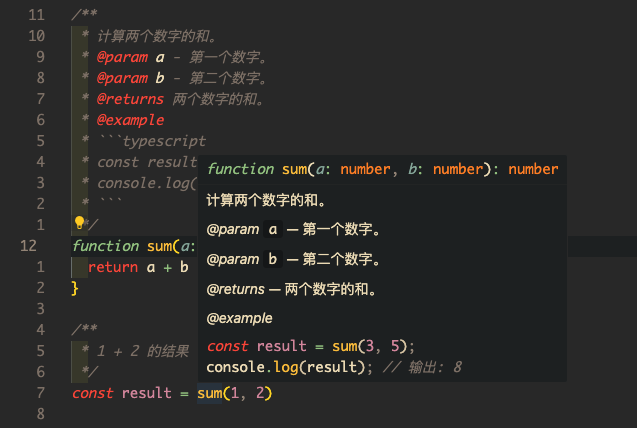

# 注释

::: info
框架已集成基于 `jsdoc` 的 `eslint` 规则 [🔗 `eslint-plugin-jsdoc`](https://www.npmjs.com/package/eslint-plugin-jsdoc)
:::

::: tip
参考资料:
- [jsdoc 文档](https://jsdoc.app)
- [tsdoc](https://tsdoc.org/)
:::

## 为什么要使用 jsdoc 注释
> `JSDoc` 是一种 `JavaScript` 文档注释规范, 已经成为事实标准, 它允许开发者为 `JavaScript` 代码添加注释，以描述函数、变量、类等的用途、参数、返回值以及其他相关信息

注释类型 | 关联性 | 格式 | `markdown` 支持 | 代码提示
--- |--- |--- |--- |---
单行 / 多行 注释 | **无法关联任何变量 / 方法** | 注释内容无任何格式 | 不支持 | ❌ 不会触发编辑器的代码提示, 因为没有关联任何变量 / 方法
[jsdoc](https://jsdoc.app) 注释 | 可以关联 任何 变量 / 方法 / 方法参数 / 方法返回值 / class / property / enum / 文件 | **[jsdoc](https://jsdoc.app) 提供了非常多的 `tag` 规范注释的格式** | 支持 `markdown` 语法 | ✅ 编辑器原生支持代码提示

使用 [jsdoc](https://jsdoc.app) 注释可以被编辑器识别, 并在调用注释关联的变量 / function 时, 会有代码提示

## 使用
❌ 错误示例:
```typescript
// sum
function sum(a: number, num2: number): number {
  return a + b
}

// 1 + 2 的结果
const result = sum(1, 2)
```

⚠️ 单行注释没有任何代码提示

✅ 正确示例:
```typescript
/**
 * 计算两个数字的和。
 * @param a - 第一个数字。
 * @param b - 第二个数字。
 * @returns 两个数字的和。
 * @example
 * ```typescript
 * const result = sum(3, 5);
 * console.log(result); // 输出: 8
 * ```
 */
function sum(a: number, b: number): number {
  return a + b
}

/** 1 + 2 的结果 */
const result = sum(1, 2)
```

::: tip
无需在 `@param` 后增加类型 `{number}`, 因为类型已经在 `function` 中声明了
:::

代码提示:



当调用使用 [jsdoc](https://jsdoc.app) 注释的 `function` 时, 编辑器会显示此注释, 并支持 `markdown` 语法, 甚至可以加入 `example` 代码块, **这对于调用者来说会非常有帮助**

> *事实上很多语言都有自己的注释规范, 通过规范的注释做到了**注释即文档**, 甚至可以通过注释生成文档*

## 了解更多

- 查看 [jsdoc 文档](https://jsdoc.app)
