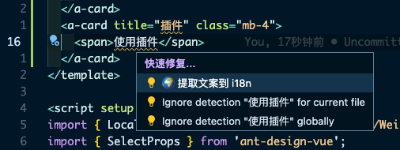
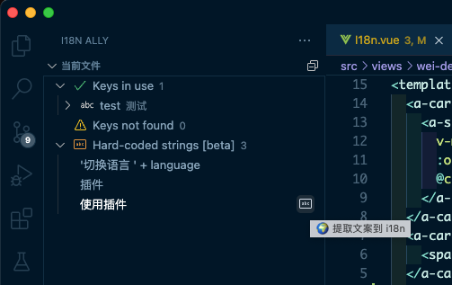
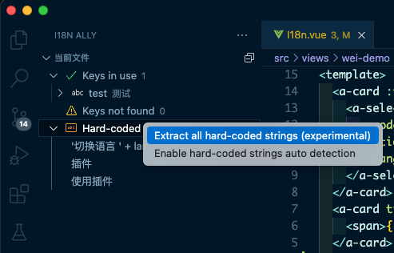
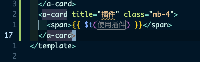
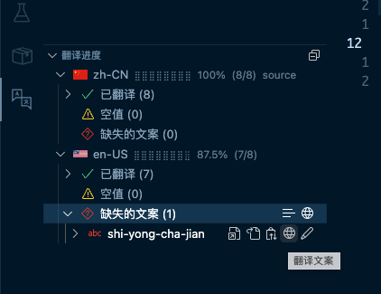
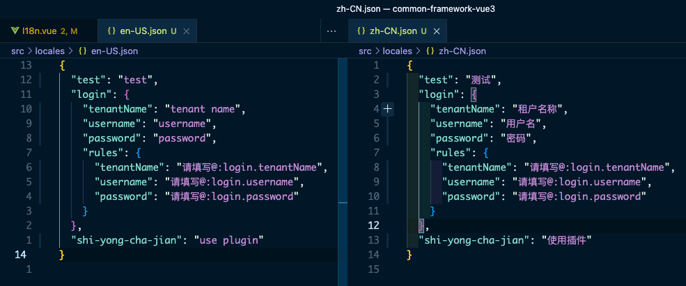

# 多语言
> **多语言功能基于 [vue-i18n](https://vue-i18n.intlify.dev/guide/essentials/syntax.html) 实现, 配合 [i18n Ally](https://marketplace.visualstudio.com/items?itemName=lokalise.i18n-ally) 插件开发**

> 当前语言缺失某个文案时, 会显示默认语言(`WeiI18n.DEFAULT_LANGUAGE`)的文案, 默认语言也没有对应的文案时直接显示为 `key`

## 使用
1. 安装 `IDE` 插件 [i18n Ally](https://marketplace.visualstudio.com/items?itemName=lokalise.i18n-ally) 获得更好的开发体验
2. 在配置文件(`vscode`) `./.vscode/settings.json` 中增加以下 [i18n Ally](https://marketplace.visualstudio.com/items?itemName=lokalise.i18n-ally) 配置
```json
{
  "i18n-ally.localesPaths": [
    "src/locales"
  ],
  "i18n-ally.enabledParsers": [
    "json"
  ],
  "i18n-ally.displayLanguage": "zh-CN",
  "i18n-ally.keystyle": "nested",
  "i18n-ally.extract.autoDetect": true,
  "i18n-ally.translate.engines": [
    "google",
    "libretranslate"
  ],
  "i18n-ally.refactor.templates": [
    {
      // affect scope (optional)
      // see https://github.com/lokalise/i18n-ally/blob/master/src/core/types.ts#L156-L156
      "source": "js-string",
      "templates": [
        // 同 template 中的 $t() 方法, 返回 string
        "WeiI18n.$t('{key}'{args})",
        // 返回保持响应式的 ComputedRef<string> 类型数据
        "WeiI18n.t('{key}'{args})"
      ],
      // accept globs, resolved to project root (optional)
      "include": [
        "src/**/*.{vue,ts,js}",
        "index.html"
      ],
      "exclude": [
        "src/config/**"
      ]
    }
  ]
}
```

3. 添加多语言信息

- 在 `<template>` 中使用:

```vue
<template>
  <div>{{ $t('test') }}</div>
</template>
```

- 在 `<script>` 中使用:

```typescript
import { WeiI18n } from '@/utils/WeiI18n'

// string 类型变量
const test = WeiI18n.$t('test') // string - 无响应式
const testRef = WeiI18n.t('test') // ComputedRef<string> - 响应式, 在切换语言时此内容会更新

// 复杂类型变量
// 可以通过 `computed` 和 `WeiI18n.$t()` 实现响应式
const testObject = computed(() => {
  return {
    test: WeiI18n.$t('test'),
    // ...
  }
})
```

## 翻译 API
[i18n-ally 支持的翻译 API](https://github.com/lokalise/i18n-ally/wiki/Machine-Translation)

🚧 `TODO`

## 使用 i18n ally 插件

1. 可以通过以下方式生成多语言的文案 `key`

- 触发快速修复


- 在侧边栏中找到 `Hard-coded strings` 中的文案, 点击提取


- 或者提取当前文件中所有 `Hard-coded strings`


2. 增加文案路径



🚧 在为属性添加文案路径后需要手动在属性名称前添加 `:`, 替换规则: `\s([\d\w\-]+)="\$t\(` => ` :$1="$t(`

3. 对缺失的文件进行翻译(`google translate`)



4. 以上所有操作会同步更新多语言文件(`src/locales/*.json`)



更多配置和使用方式参考 [i18n Ally](https://marketplace.visualstudio.com/items?itemName=lokalise.i18n-ally)
