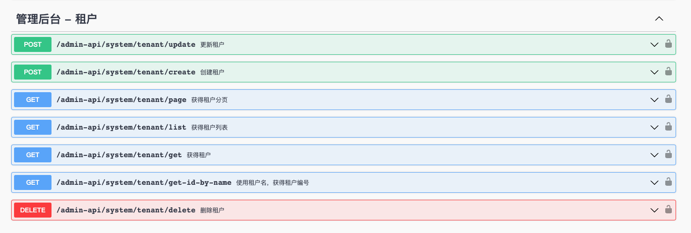
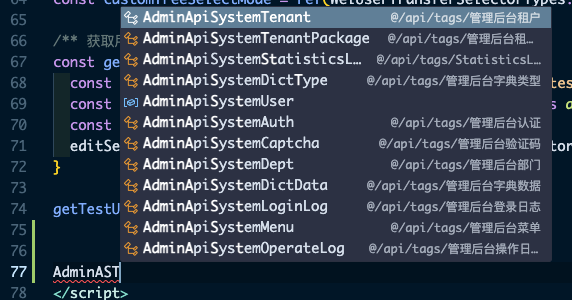
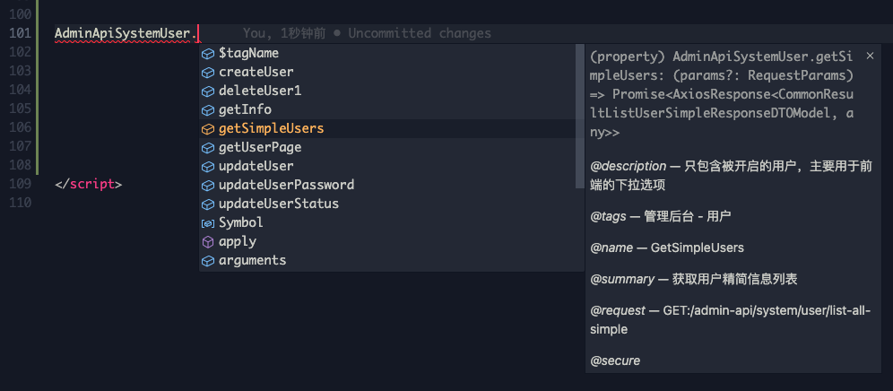
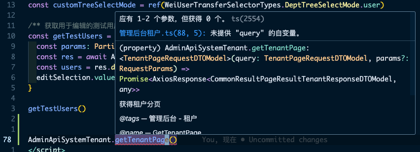

# 请求
> 基于 [swagger-typescript-api](https://github.com/acacode/swagger-typescript-api) 生成了 `API` 层代码, 生成逻辑参考 [代码生成](./codegen.md)

::: warning Tips
推荐 ✅[使用代码生成的 `tag` 发起请求](#发起请求-使用代码生成的-tag-发起请求), 若后端提供的 `Swagger` 不规范, 可 💪🏻[使用框架封装的 `service` 发起请求](#发起请求-使用-service), 避免 ❌[直接使用 `axios` 发起请求](发起请求-直接使用-axios)
:::

## 发起请求(使用代码生成的 tag 发起请求)

> 需要先执行 `pnpm run codegen` 生成 `tag class` 代码, 详见 [代码生成](./codegen.md)


在 `Swagger UI` 中找到对应的 `tag`, 例如 *管理后台 - 租户*


输入接口的 `path` 部分, 例如 `/admin-api/system/tenant/page` => `AdminApiSystemTenant`, 此时会有代码提示


**每个接口对应一个方法**, 找到要调用的方法

> *此处的方法名对应后端定义的 `OperationId`, 如果不确定使用哪个方法可以到 `tag` 中查找*


可以查看此方法对应的接口信息和数据类型:

- 接口描述
- 接口的请求参数类型
- 接口的返回值类型

不需要再手动补充类型定义

## 发起请求(使用 service)

::: warning
应该优先[使用代码生成的 tag 发起请求](#发起请求-使用代码生成的-tag-发起请求),
代码生成可以确保类型安全, 不用再手动编写请求 `function / type`;
<br>
如果后端没有按照 `OpenAPI` 规范声明接口类型:

- 首先应该要求后端补全请求参数与返回值的类型, 因为前端的代码生成依赖于标准的 `Swagger JSON`
- 若后端无法提供, 则无法使用代码生成
:::

若无法使用代码生成:

```typescript
import { service } from '@/httpRequest/service'

console.log(service) // AxiosInstance
```

从 `@/httpRequest/service.ts` 中引入 `service`, 这是项目中使用的 `axios` 实例

## 发起请求(直接使用 axios)

::: danger
应该优先[使用代码生成的 tag 发起请求](#发起请求-使用代码生成的-tag-发起请求), 或使用 [service](#发起请求-使用-service)
<br>
框架通过 `request interceptors` / `response interceptors` 内置了 **鉴权 / 刷新 token / 参数处理 / 错误处理** 等功能, 如果直接使用 `axios`, 则不会有这些功能
:::

```typescript
import axios from 'axios'
// ...
```

## 错误处理
> 框架在 `dev-auth(1.x 版本)` `dev-auth-v2(2.x 版本)` 分支(*版本间差异见 [分支](./introduce.md#分支)*)中会在响应拦截器中判断, 如果返回值的状态码(`code`)不是 `200`, 则也会像成功的请求一样直接返回 `response`, 这样做会 **导致每个请求都需要判断状态码**, 造成代码冗余

::: tip
**自 `dev-auth-v3(3.x)` 起改为 `code !== 200` 时抛出异常(`error` 为 `ResponseError`, 与 `response` 结构相同)**
:::

以重置密码请求为例, 旧密码输入错误时, `response` 为:
```json
{ "code": 1002003005, "data": null, "msg": "用户密码校验失败" }
```

以下是两种错误处理方式的代码示例对比:

::: code-group

```typescript [直接返回 response(1.x / 2.x)]
loading.value = true
try {
  await AdminApiSystemUserProfile.updateUserProfilePassword(requestParams)
  if (res.code === Responsecode.Successfully) {
    message.success('修改成功')
  }
}
finally {
  loading.value = false
}
```

```typescript [抛出异常(3.x)]
loading.value = true
try {
  await AdminApiSystemUserProfile.updateUserProfilePassword(requestParams)
  message.success('修改成功')
}
finally {
  loading.value = false
}
```

:::

::: info
在响应拦截器中会判断 `code`, 并 **在错误信息弹窗中显示 `msg`**
:::

如需 **根据错误码处理异常** 或 **处理其他异常**, 可使用 `catch` 捕获异常:

::: code-group

```typescript [async-await 写法]
loading.value = true
try {
  await AdminApiSystemUserProfile.updateUserProfilePassword(requestParams)
  message.success('修改成功')
}
catch (error) {
  if (error instanceof ResponseErorr) { // 处理接口返回错误码的情况
    console.log(error.data.code) // response code
  }
  else if (error instanceof AxiosError) { // 处理请求失败(例如 Network error / Timeout error / ...)
    // 此处 error 的类型为 `AxiosError`
    console.error(error)
  }
  else { // 与请求无关的其他错误
    throw error
  }
}
finally {
  loading.value = false
}
```

```typescript [then / catch / finally 写法]
loading.value = true
AdminApiSystemUserProfile.updateUserProfilePassword(requestParams)
  .then(() => {
    message.success('修改成功')
  })
  .catch((error) => {
    if (error instanceof ResponseErorr) { // 处理接口返回错误码的情况
      console.log(error.data.code) // response code
    }
    else if (error instanceof AxiosError) { // 处理请求失败(例如 Network error / Timeout error / ...)
      console.error(error)
    }
    else { // 与请求无关的其他错误
      throw error
    }
  })
  .finally(() => {
    loading.value = false
  })
```
:::

所有错误类型:

错误类型 | error 类型 | 错误提示弹窗
--- |--- |---
接口返回错误码 | `ResponseError`, 实际为 `AxiosResponse<HttpRequestResponse>` | 显示
请求失败 | `AxiosError` | 只有 `Network Error` / `timeout` / `Request failed ` `with status code` 时显示
与请求无关的其他错误 | `unknown` | 不显示

## 分页
> 框架封装了用于处理分页参数和封装 `ant-design-vue pagination` 的 `hooks` `usePagination`

以用户管理页为例:

```typescript
/** 列表请求参数 */
const requestParams = reactive(new UserPageRequestDTOModel())
/** 初始化绑定分页请求参数 */
const { pagination } = usePagination(requestParams, getResources)
/** 列表数据 */
const resources = ref<Array<UserPageItemResponseDTOModel>>([])
/** 获取表格数据 */
async function getResources() {
  loading.value = true
  try {
    requestParams.createTime = dateRangeParams.value // 开始 - 结束时间
    const res = await AdminApiSystemUser.getUserPage(requestParams)
    resources.value = res.data.data!.list
    pagination.total = res.data.data!.total
  }
  finally {
    loading.value = false
  }
}
```

```html
<a-table
  :columns="columns"
  :data-source="resources"
  :loading="loading"
  :pagination="pagination">
  <!-- ... -->
</a-table>
```

`pagination` 可作为 `a-table` 的 `pagination` 参数, 类型与 [Pagination 组件](https://3x.antdv.com/components/pagination-cn/) 的 `props` 一致

参数:

参数 | 类型 | 说明
--- |--- |---
`params` | `typeof BasePaginationParamsType` | 当用户翻页或调整每页显示条数时, 会同步更新到请求参数中
`getResources` | `Function` | 列表请求, 当用户翻页或调整每页显示条数时, 会调用 `getResources` 发起请求

返回值:

返回值 | 类型 | 说明
--- |--- |---
`pagination` | `PaginationProps` | 可作为分页组件 `prop` 或表格的 `pagination prop`
`resetPagination` | `<P extends BasePaginationParamsType>(params: P): void` | 重置分页参数

## 正在请求的接口
> since `3.0.4`

当通过 [使用代码生成的 `tag` 发起请求](#发起请求-使用代码生成的-tag-发起请求) / [使用框架封装的 `service` 发起请求](#发起请求-使用-service) 请求接口时, 框架会 **记录当前正在请求(`pending` 状态)的接口**

可以用全局的 `$isPending()` 判断某个接口或所有接口是否处于 `pending` 状态, 在一个典型的 `CRUD` 页面中, 可用于为 提交按钮 / 删除按钮 增加 `loading` / `disabled` 状态

```html{5,10}
<a-popconfirm
  title="确定要删除吗？"
  ok-text="确定"
  cancel-text="取消"
  :disabled="$isPending('delete', record.id)"
  @confirm="handleDelete(record.id)">
  <a-button
    type="link"
    danger
    :disabled="$isPending('delete', record.id)"
    class="p-0">
    删除
  </a-button>
</a-popconfirm>
```

```html{3}
<a-modal
  v-model:visible="visible"
  :confirm-loading="$isPending()"
  @ok="onSubmitFormData()"
  @cancel="handleClose">
  <!-- ... -->
</a-model>
```

### examples
- `$isPending()`: 当前是否有接口处于 `Pending` 状态
- `$isPending('/page')`: 当前是否有 `url` 中 **包含** `/page` 的接口处于 `Pending` 状态
- `$isPending('/page', '001')`: 当前是否有 `url` **包含** `/page`, 且请求参数中的 `params` / `data` 中包含 `001` 的接口处于 `Pending` 状态
- `$isPending('/page', true)`: 当前是否有 `url` **等于** `/page` 的接口处于 `Pending` 状态

### 关于 url
对于 `GET` 请求, `params` 请求参数已经包含在 `url` 中了, 可以直接通过第一个参数判断

## 生成请求代码
参考 [代码生成](./codegen.md)

## 参考

- [pont](https://github.com/alibaba/pont): 受制于后端的 `swagger json` 格式, 兼容性差, 需要后端导出标准的符合 `OpenApi` 规范的 `Swagger` 文档, 实测芋道的 `swagger json` 解析报错
- [openapi-typescript-codegen](https://github.com/ferdikoomen/openapi-typescript-codegen)
- [swagger-typescript-api](https://github.com/acacode/swagger-typescript-api)
- [openapi-typescript](https://github.com/drwpow/openapi-typescript)
- [swagger-codegen(java)](https://github.com/swagger-api/swagger-codegen)
- [swagger-autogen](https://github.com/davibaltar/swagger-autogen)
