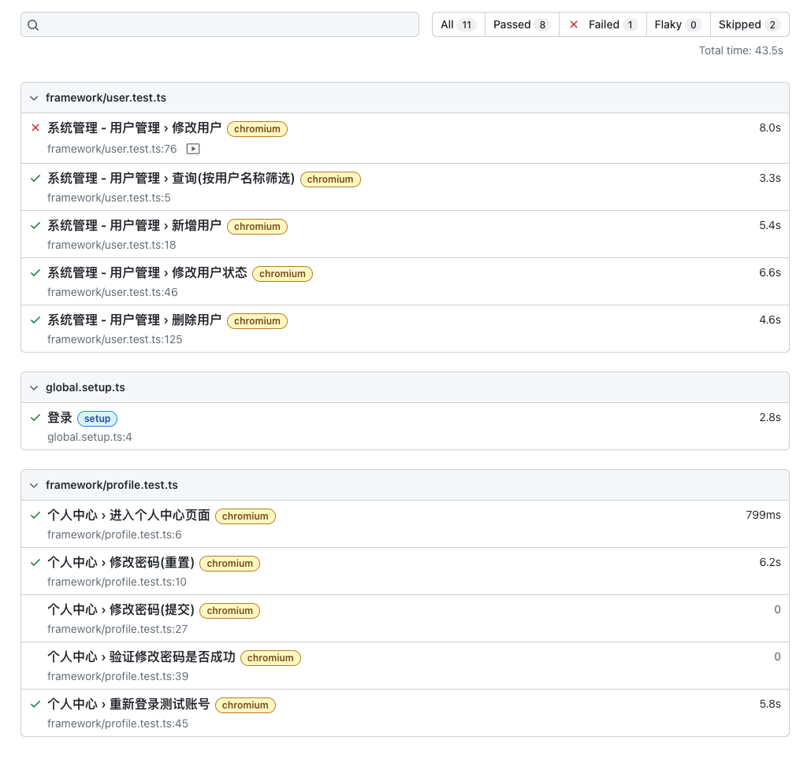
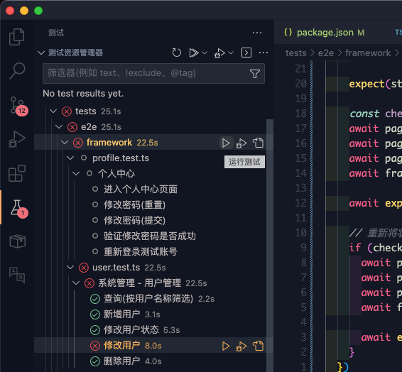

# 软件测试<Badge type="info" text="待完善" />
> 如果你不了解前端测试, 可以先阅读以下文章:
> - [了解前端自动化测试](https://juejin.cn/post/7238027797314568229?searchId=20230909150354C6FA5535D4D15C8486E2)
> - [端到端测试(playwright)](https://juejin.cn/post/7155655166350819341)

## 单元测试
> 前端的单元测试基于 [vitest](https://cn.vitest.dev/)(单元测试库) 和 [@vue/test-utils](https://test-utils.vuejs.org/guide/)(用于组件测试)

> 安装 `vscode` 插件 [vitest](https://marketplace.visualstudio.com/items?itemName=ZixuanChen.vitest-explorer) 获得更好的开发体验

```bash
# 执行单元测试(全部)
pnpm run test

# 执行某个测试文件
npx vitest run path/to/spec.test.ts
```

### 现有单元测试
框架中包含了一些简单的测试文件:

- `src/wei-components/WeiSchemaForm/__test__/*.test.ts`: `WeiSchemaForm` 组件的测试
- `src/utils/math.test.ts`: [数值运算](./calculator.md) 单元测试

## e2e 测试(端到端测试)
> 目前前端有两个优秀的测试框架(`cypress` / `playwright`), 本项目使用 [playwright](https://playwright.dev/) 作为测试框架, 测试框架对比分析参考 [Cypress vs Playwright](https://blog.csdn.net/weixin_54928936/article/details/130509659)

::: tip
**要使用 `playwright`, 至少需要先阅读官方文档的 [📚 Getting Started 章节](https://playwright.dev/docs/writing-tests)**
:::

### 使用
1. [安装用于测试的浏览器](#安装用于测试的浏览器)
2. [启动本地服务](#启动本地服务)
3. [运行测试](#运行测试)

### 运行环境
> `playwright` 对于操作系统和 `Node.js` 版本是有要求的, 参考自 [System requirements](https://playwright.dev/docs/intro#system-requirements)

- Node.js 16+
- Windows 10+, Windows Server 2016+ or Windows Subsystem for Linux (WSL).
- MacOS 12 Monterey or MacOS 13 Ventura.
- Debian 11, Debian 12, Ubuntu 20.04 or Ubuntu 22.04.

### 安装用于测试的浏览器
> `playwright` 会调用浏览器执行测试用例, ~~开发环境默认直接调用本地已经安装的 `chrome`, 因此无需按官方文档安装~~, `chrome` 无法使用录制功能, 所以改为默认使用 `chromium`

::: danger 如何安装浏览器
在开始编写 `e2e` 测试用例之前, 需要先选择使用哪个浏览器进行测试:

- `chrome/edge`: 直接调用本地已经安装的 `chrome/edge`, 无法使用录制功能, **无需安装**
- `chromium`: 下载 `chromium`, 可以使用录制功能, <span style="font-weight: bold; color: black;">需要执行 `npx playwright install chromium`</span> 安装

在执行测试用例时, 需要在 `playwright.config.ts` 文件中修改使用哪个浏览器, 参考以下代码
:::

如果要选择其他浏览器进行测试, 可以修改配置文件 `playwright.config.ts` 中的 `projects`:

::: details `playwright.config.ts`
<<< @/../playwright.config.ts
:::

### 启动本地服务
> `e2e` 测试是模拟用户真实的使用场景和行为, 所以需要能够访问生产环境(`production`)

```bash
# build
pnpm run build

# 启动本地服务
pnpm run preview
```

启动后即可访问 [http://localhost:58585](http://localhost:58585), 之后的测试会访问这个地址

### 运行测试
> 可以安装 `vscode` 插件 [Playwright Test for VSCode](https://marketplace.visualstudio.com/items?itemName=ms-playwright.playwright) 获得更好的开发体验

```bash
# 执行 e2e 测试(headless 模式)
pnpm run test:e2e

# 执行 e2e 测试(headed 模式)
pnpm run test:e2e:headed

# 执行 e2e 测试(ui 模式)
pnpm run test:e2e:ui
```

- `headless` 模式: 不显示浏览器, 参考 [headless](https://playwright.dev/docs/api/class-testoptions#test-options-headless)
- `headed` 模式: 显示浏览器
- `ui` 模式: 显示 `playwright` 提供的可以运行 / 调试 / 查看快照 的容器, 参考 [UI mode](https://playwright.dev/docs/test-ui-mode)

### 录制模式
> 录制模式用于录制新的测试用例, 可以录制你对于页面的操作并生成代码, 可以极大提高效率

官网示例:

<video width="100%" height="100%" controls=""><source src="https://user-images.githubusercontent.com/13063165/197979804-c4fa3347-8fab-4526-a728-c1b2fbd079b4.mp4" type="video/mp4"> Your browser does not support the video tag.</video>

```bash
# 需要先运行 preview 启动本地服务
# pnpm run preview

npx playwright codegen http://10.190.113.233:31023
```

### 测试报告
> 在测试完毕后会生成测试报告, 参考 [test reports](https://playwright.dev/docs/test-reporters)



测试报告中包含每个测试用例的结果和详细信息, 可以查看失败的用例的 [截图](https://playwright.dev/docs/screenshots) 和 [视频](https://playwright.dev/docs/videos)

## 🚀 进阶

### 测试目录结构

```bash
📂 tests
├── 📂 e2e                          -------- 端到端测试
│  ├── 📂 framework                 -------- 框架功能测试
│  │  ├── 📃 profile.test.ts
│  │  └── 📃 user.test.ts
│  ├── 📃 framework-test.ts         -------- 包含封装和扩展后的 test / expect
│  └── 📃 global.setup.ts           -------- setup project, 用于在每次测试之前登录并保存用户信息
├── 📂 fixtures                     -------- 参考官方的 fixture
│  ├──  code-image.png
│  ├── 📃 FrameworkPage.ts          -------- 封装了与业务无关的操作, 例如登录 / 退出登录 / 解析表格数据
│  ├──  puzzle-image.png
│  └── 📃 TestConfig.ts             -------- 静态数据与测试时的配置
└── 📂 utils
   ├── 📃 CaptchaImage.test.ts      -------- CaptchaImage.ts 的单元测试文件
   └── 📃 CaptchaImage.ts           -------- 封装了登录时计算图片验证码的拖动距离算法
```

### 编写端到端测试用例
首先启动 `preview` 和 `playwright` 录制模式:

```bash
pnpm run build
pnpm run preview
```

```bash
npx playwright codegen http://10.190.113.233:31023
```

创建测试文件:

```bash
code tests/e2e/framework/my-test.test.ts
```

```typescript
// 从 framework-test.ts 中引入封装的 test / expect
import { expect, test } from '../framework-test'

// TestConfig 是测试相关的静态配置
// TestConfigAccount 是用测试的账号
import { TestConfig, TestConfigAccount } from '../../fixtures/TestConfig'

// 使用 test.describe 为测试用例分组
test.describe('测试 1', () => {
  // 测试用例 1.1
  test('1.1 ...', async ({ page, frameworkPage }) => {
    // frameworkPage 是 FrameworkPage 类的实例, 封装了一些公共的方法
    // 详见 `tests/fistures/FrameworkPage.ts`
  })
  // 测试用例 1.2
  test('1.2 ...', async ({ page }) => {
  })
})
```

::: tip
在 `tests/fistures/FrameworkPage.ts` 中封装了自动化登录的逻辑, 无需在每个测试用例中都登录一遍, 详见 [自动拖动登录验证码](./automation.md#自动拖动登录验证码)
:::

将录制的代码复制到测试用例中并增加 [断言](https://playwright.dev/docs/test-assertions)

::: details 查看 `tests/e2e/framework/user.test.ts` 了解如何编写一个 `CRUD` 页面的测试用例
<<< @/../tests/e2e/framework/user.test.ts
:::

- 使用 `vscode` 插件 [Playwright Test for VSCode](https://marketplace.visualstudio.com/items?itemName=ms-playwright.playwright) 运行或调试测试用例:



<video width="100%" height="100%" controls=""><source src="../assets/e2e-test-record.webm" type="video/webm"> Your browser does not support the video tag.</video>

- 或者在命令行中执行(测试结束后可查看测试报告):

```bash
pnpm run test:e2e
```

## 参考
- [playwright](https://playwright.dev/docs/writing-tests)
- [playwright 最佳实践](https://playwright.dev/docs/best-practices)
- [前端E2E自动化测试开发](https://juejin.cn/post/7155655166350819341)
- [前端自动化测试基础概念与方案](https://juejin.cn/post/7238027797314568229?searchId=20230909150354C6FA5535D4D15C8486E2)
